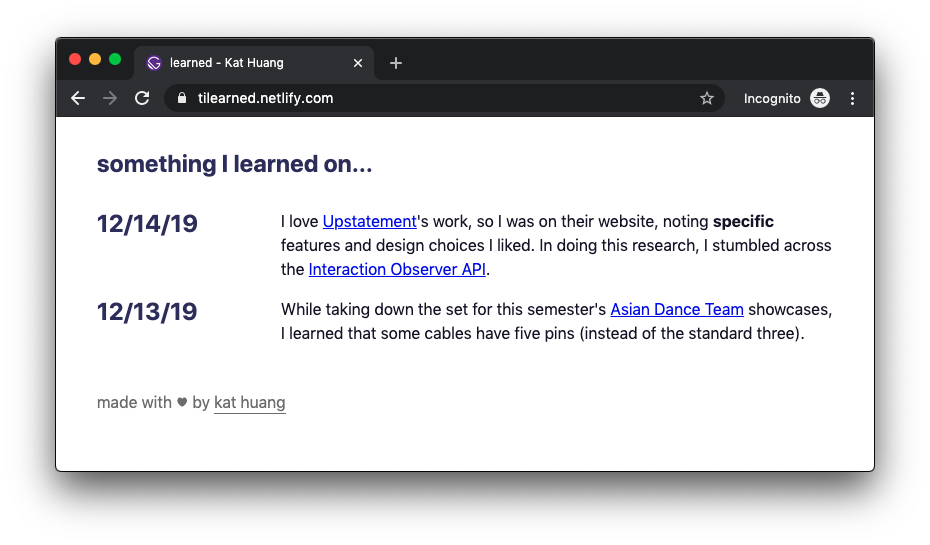
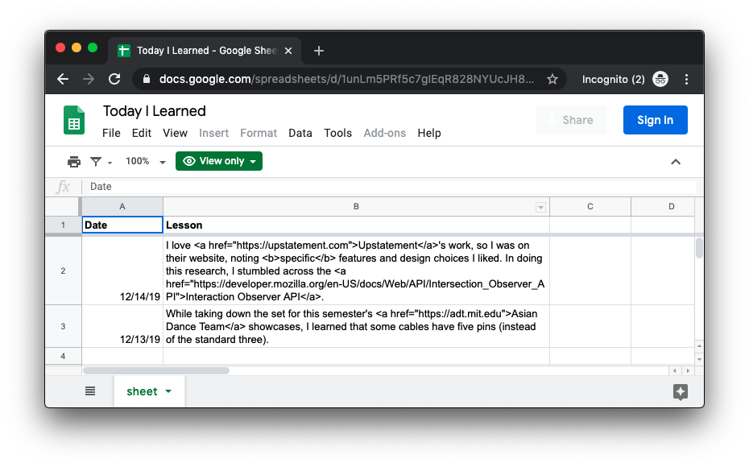

# learned

a [site](https://tilearned.netlify.com) with something I learn each day

built with [Gatsby](https://gatsbyjs.org) and the [Sheety API](https://sheety.co)

**I wrote a [step-by-step tutorial](https://katmh.com/gatsby-sheety-tutorial) on how I built this!**

